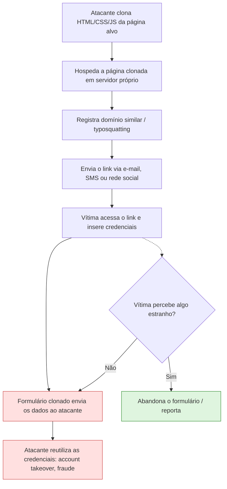

# 🛡️ Social Login Lab — Simulação Educacional de Phishing

> Desafio de Cibersegurança (DIO) — versão **segura e funcional**: reproduz o fluxo visual e conceitual de uma página de phishing para fins de estudo, sem jamais capturar, transmitir ou armazenar credenciais reais.

[](./LICENSE)


---

## 📋 Sumário

- [Visão geral](#-visão-geral)
- [Por que esta versão é segura](#-por-que-esta-versão-é-segura)
- [Relação com o desafio original](#-relação-com-o-desafio-original)
- [Como funciona um ataque real de phishing](#-como-funciona-um-ataque-real-de-phishing)
- [Arquitetura da simulação](#-arquitetura-da-simulação)
- [Estrutura do repositório](#-estrutura-do-repositório)
- [Como executar](#-como-executar)
- [Credenciais de teste](#-credenciais-de-teste)
- [Indicadores de phishing demonstrados](#-indicadores-de-phishing-demonstrados)
- [Verificação técnica de segurança](#-verificação-técnica-de-segurança)
- [Evidências e capturas de tela](#-evidências-e-capturas-de-tela)
- [Documentação complementar](#-documentação-complementar)
- [Objetivos de aprendizagem](#-objetivos-de-aprendizagem)
- [Tecnologias utilizadas](#-tecnologias-utilizadas)
- [Autor](#-autor)
- [Licença](#-licença)

---

## 🔎 Visão geral

Este projeto simula, em ambiente **100% local e estático**, a tela de login de uma rede social genérica — o suficiente para demonstrar visualmente o conceito de **phishing por clonagem de página**, sem reproduzir a identidade visual de nenhum serviço real e sem jamais coletar uma credencial sequer.

A proposta original do desafio pede o uso do `setoolkit` (Kali Linux) para clonar a página do Facebook e capturar senhas de verdade em uma página hospedada. Esta entrega cumpre o mesmo objetivo pedagógico — entender o vetor de ataque, documentar o raciocínio técnico e publicar o resultado no GitHub — por um caminho que **não produz uma ferramenta de phishing reaproveitável fora do laboratório**.

## 🔒 Por que esta versão é segura

| Característica do phishing real | Nesta simulação |
|---|---|
| Clona a identidade visual de um serviço real (logo, cores, domínio) | Marca genérica e fictícia ("Social Login Lab"), aviso de laboratório visível na tela |
| Envia os dados digitados para um servidor do atacante | `form.addEventListener("submit")` chama `event.preventDefault()` — **nenhum dado sai do navegador** |
| Persiste a credencial capturada (arquivo, banco, log) | Nenhuma chamada a `fetch`, `XMLHttpRequest`, `localStorage` ou `sessionStorage` em todo o código |
| Redireciona a vítima para o serviço real após capturar a senha | O formulário é apenas limpo (`form.reset()`) e exibe uma mensagem educativa |
| Pode ser reutilizada por terceiros como ferramenta de ataque | É uma aplicação estática sem backend — não há "modo de produção" a ativar |

A seção [Verificação técnica de segurança](#-verificação-técnica-de-segurança) explica como auditar essas garantias você mesmo, com o DevTools do navegador.

## 🔗 Relação com o desafio original

O material de referência do curso (repositório [`cassiano-dio/cibersecurity-desafio-phishing`](https://github.com/cassiano-dio/cibersecurity-desafio-phishing)) demonstra o uso do `setoolkit` para:

1. Clonar o HTML de uma página de login real;
2. Hospedar essa cópia em um servidor controlado pelo atacante;
3. Capturar e persistir as credenciais submetidas pela vítima.

Nesta entrega, as etapas 2 e 3 foram **deliberadamente removidas**. O `setoolkit` é tratado apenas como referência conceitual de conteúdo de aula — não é necessário instalá-lo nem executá-lo para concluir este desafio. O que se mantém é:

- a reprodução visual de uma tela de autenticação como isca de engenharia social;
- a análise dos indicadores que permitem reconhecer esse tipo de página;
- a documentação completa do raciocínio técnico;
- a publicação organizada no GitHub.

## 🧭 Como funciona um ataque real de phishing

Para contextualizar o que esta simulação representa, o fluxo completo de um ataque real de *credential harvesting* é:



> Veja também o diagrama ilustrado em [`images/fluxo-ataque-phishing.png`](./images/fluxo-ataque-phishing.png).

Nesta simulação, o fluxo **para no passo E** — a submissão é interceptada localmente e nunca avança para F/G.

## 🏗️ Arquitetura da simulação

```text
Navegador
   │
   ├── index.html         → estrutura da tela de login simulada
   ├── css/styles.css     → estilo visual (genérico, sem branding de terceiros)
   └── js/app.js          → intercepta o submit, não envia nem persiste nada
```

Todo o processamento começa e termina no próprio navegador do usuário. Não existe backend, API, banco de dados ou serviço externo envolvido.

## 📁 Estrutura do repositório

```text
desafio-phishing-awareness/
├── README.md
├── LICENSE
├── .gitignore
├── index.html
├── css/
│   └── styles.css
├── js/
│   └── app.js
├── docs/
│   ├── GITHUB.md                  → passo a passo de publicação no GitHub
│   ├── LABORATORIO.md             → preparação, execução e verificação técnica
│   ├── RELATORIO.md               → relatório técnico da decisão de arquitetura
│   ├── TEXTO_ENTREGA.md           → texto para o campo "Entregar Projeto" da DIO
│   └── mitigacoes-avancadas.md    → controles avançados de defesa contra phishing
└── images/
    └── fluxo-ataque-phishing.png  → diagrama do fluxo de um ataque real
```

## ▶️ Como executar

### Opção 1 — abrir diretamente

Basta abrir `index.html` no navegador.

### Opção 2 — servidor HTTP local (recomendado)

Com Python instalado:

```bash
python -m http.server 8000
```

Depois acesse:

```text
http://127.0.0.1:8000
```

## 🔑 Credenciais de teste

Use **apenas** valores fictícios:

```text
E-mail: aluno@laboratorio.local
Senha: senha-ficticia-123
```

Nunca insira, neste ou em qualquer outro laboratório desse tipo: senha real, e-mail associado a senha real, token, cookie de sessão, chave de API ou qualquer dado de terceiros.

## 🚩 Indicadores de phishing demonstrados

Mesmo sendo uma simulação, o exercício reforça a análise destes sinais, válidos para qualquer página real de phishing:

- domínio diferente do domínio legítimo (ou variações sutis — *typosquatting*);
- URL encurtada ou estruturalmente suspeita;
- pressão psicológica, urgência ou tom alarmista na mensagem que traz o link;
- solicitação inesperada de credenciais fora do fluxo normal de uso;
- inconsistências de idioma, layout ou identidade visual;
- ausência de HTTPS válido ou certificado emitido há poucas horas;
- formulário cujo destino de envio (`action`) não corresponde ao domínio exibido.

## 🔬 Verificação técnica de segurança

Qualquer pessoa pode auditar as garantias deste projeto sem precisar confiar apenas no texto do README:

1. Abra o DevTools do navegador (`F12`) → aba **Network**, antes de testar o formulário;
2. Preencha os campos com os dados fictícios e clique em "Entrar";
3. Confirme que **nenhuma requisição** aparece na aba Network — o `preventDefault()` impede qualquer envio;
4. Na aba **Application → Storage**, confirme que `localStorage` e `sessionStorage` permanecem vazios;
5. Inspecione `js/app.js`: não há chamada a `fetch`, `XMLHttpRequest`, `localStorage.setItem` ou `sessionStorage.setItem` em nenhum ponto do código.

Passos detalhados também estão em [`docs/LABORATORIO.md`](./docs/LABORATORIO.md).

## 🖼️ Evidências e capturas de tela

A pasta `/images` está preparada para receber capturas de tela do ambiente local do aluno, além do diagrama de fluxo já incluído. Sugestão de nomenclatura:

```text
/images/
├── fluxo-ataque-phishing.png       (já incluído)
├── 01-home.png
├── 02-formulario-preenchido.png
└── 03-mensagem-laboratorio.png
```

As capturas de tela devem ser produzidas no próprio ambiente local e **não devem conter dados pessoais ou credenciais reais**.

## 📚 Documentação complementar

| Documento | Conteúdo |
|---|---|
| [`docs/LABORATORIO.md`](./docs/LABORATORIO.md) | Preparação do ambiente, execução passo a passo e verificação técnica de segurança |
| [`docs/RELATORIO.md`](./docs/RELATORIO.md) | Relatório técnico da decisão de arquitetura e dos controles implementados |
| [`docs/mitigacoes-avancadas.md`](./docs/mitigacoes-avancadas.md) | Controles avançados de defesa: dnstwist, Certificate Transparency, DMARC/SPF/DKIM, WebAuthn/FIDO2, simulações internas de phishing |
| [`docs/GITHUB.md`](./docs/GITHUB.md) | Passo a passo de publicação/atualização do repositório no GitHub |
| [`docs/TEXTO_ENTREGA.md`](./docs/TEXTO_ENTREGA.md) | Texto pronto para o campo "Entregar Projeto" da plataforma DIO |

## 🎯 Objetivos de aprendizagem

- Compreender o conceito de phishing e engenharia social na prática;
- Identificar elementos visuais e comportamentais usados em páginas falsas;
- Estruturar um laboratório local, controlado e auditável;
- Documentar decisões técnicas e limitações de segurança de forma transparente;
- Versionar e apresentar o trabalho no GitHub de forma profissional;
- Demonstrar como uma simulação pode atingir o objetivo pedagógico sem colocar credenciais reais em risco.

## 🛠️ Tecnologias utilizadas

- HTML5, CSS3, JavaScript (vanilla, sem dependências)
- Git / GitHub
- Python 3 (opcional, apenas para servir a página localmente)
- Kali Linux / SEToolkit — citados como referência conceitual do desafio original, não utilizados na execução desta entrega

## 👤 Autor

**José Wagner Blanco Junior**
[github.com/josewagnerbljr-sys](https://github.com/josewagnerbljr-sys)

Projeto acadêmico de estudo em Cibersegurança — Desafio DIO.

## 📄 Licença

Distribuído sob licença MIT — veja [`LICENSE`](./LICENSE) para detalhes.
